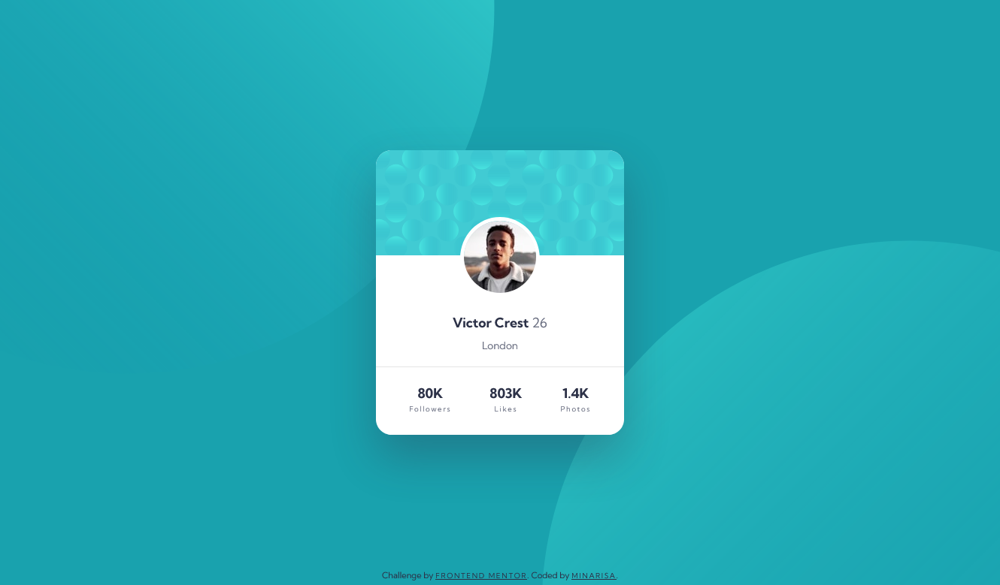

# Frontend Mentor - Profile card component

## Welcome! 👋

## Table of contents

- [Overview](#overview)
  - [The challenge](#the-challenge)
  - [Screenshot](#screenshot)
  - [Links](#links)
- [My process](#my-process)
  - [Built with](#built-with)
- [Author](#author)

## Overview

### The challenge

- Build out the project to the designs provided

### Screenshot

### Links

- Solution URL: [GitHub](https://github.com/Minarisa/fem-profile-card-component-main)
- Live Site URL: [GitHub Page](https://minarisa.github.io/fem-profile-card-component-main/)

### Built with

- Semantic HTML5 markup
- CSS custom properties
- Flexbox
- Mobile-first workflow

## Author

- Frontend Mentor - [@Minarisa](https://www.frontendmentor.io/profile/minarisa)

**SEE YOU** 🚀
